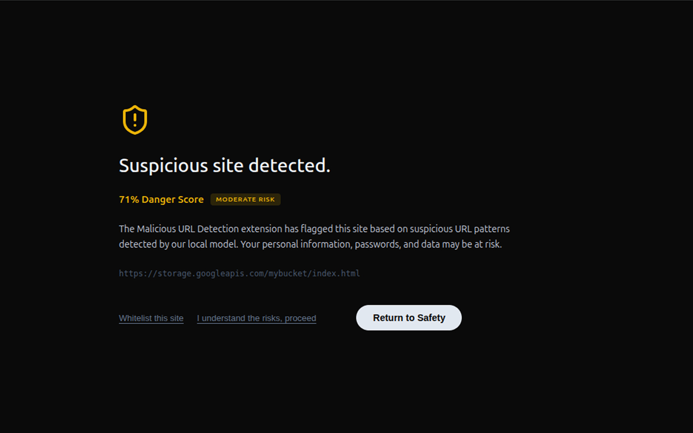
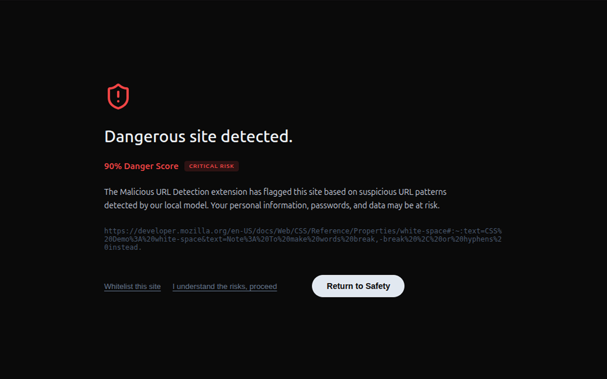
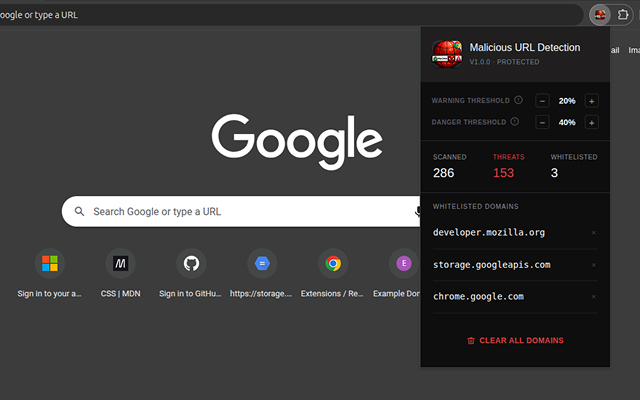

# Malicious URL Detection Project

## Overview

This project develops a machine learning model to detect and classify malicious URLs with high accuracy. Rather than relying on synthetically generated datasets, I collected a real-world dataset by aggregating multiple threat intelligence sources and enriching benign URLs with realistic features extracted from live web pages.

### Why Real-World Data?

Initial testing with a popular Kaggle malicious URL dataset revealed that it was synthetically generated, producing unrealistic results that wouldn't generalize to real-world scenarios. This motivated me to build my own dataset from authentic sources.

## Project Structure

### Datasets

The project utilizes multiple data sources to create a complete dataset:

### Benign URLs (~3M URLs)

Started with the **Alexa Top 1M** domain list, which contained bare domains (e.g., `google.com`) without schema, path, query parameters, or other URL components.

#### URL Resolution

Developed a robust URL resolution pipeline to convert bare domains into complete, realistic URLs:

- Attempts HTTPS connections first, then falls back to HTTP
- Follows redirects to capture final destination URLs
- Implements exponential backoff for rate-limited servers
- Uses concurrent workers (`ThreadPoolExecutor`) for efficient parallel processing
- Processing time: ~3 days for the entire dataset
- Retried failed URLs multiple times and used VPN to maximize resolution success

#### URL Enrichment

Web scraped each resolved URL to extract internal links and additional URL components:

- Parsed HTML pages using BeautifulSoup
- Extracted links from the page (limited to same domain)
- Converted relative paths to absolute URLs
- Collected up to 7 random links per page
- Implemented retry logic with exponential backoff for failed requests
- Result: ~3M realistic URLs with query parameters and varied paths

### Malicious URLs (~1.2M URLs)

Aggregated URLs from **10 distinct threat intelligence sources**:

#### Malicious URLs

Multiple threat intelligence sources including:

- **AlienVault OTX**: Open Threat Exchange malicious URLs
- **CyberCrime Tracker**: Cybercriminal infrastructure tracking data
- **GitHub Phishing Database**: Community-contributed phishing URLs
- **Maltrail**: Malware trail detection data
- **PhishTank**: Verified phishing database
- **Sophos Labs**: Enterprise security threat data (2023-2025)
- **ThreatFox**: Threat intelligence platform data
- **URLhaus**: Malicious URL repository
- **PhiUSIIL**: Phishing URL Intelligence and Incident Library

### Notebooks

#### Analysis Notebooks

- `notebooks/analysis.ipynb`: Main analysis and exploratory data analysis
- `notebooks/malicious-url-detection.ipynb`: Model development and evaluation
  - **Note**: This notebook was executed on Kaggle due to its computational requirements (feature extraction, model training, and hyperparameter tuning on large datasets)

#### Benign URL Processing

- `notebooks/benign/extract_resolved.ipynb`: Extract resolved IPs from Alexa domains
- `notebooks/benign/resolve_urls.ipynb`: Resolve domain names to IP addresses
- `notebooks/benign/enrich_resolved.ipynb`: Enrich resolved data with additional features
- `notebooks/benign/clean_enriched.ipynb`: Data cleaning and preprocessing

#### Malicious URL Processing

- `notebooks/malicious/collect_urls.ipynb`: Aggregate URLs from various threat sources
- `notebooks/malicious/clean_collected.ipynb`: Data cleaning and standardization

### Web Extension

The project includes a Chrome web extension that integrates the malicious URL detection model directly into the browser for real-time URL scanning and protection.

#### Features

**URL Detection & Analysis**

- Automatically captures URLs entered by the user during browsing
- Passes URLs through the trained ML model in real-time
- Generates danger scores based on URL characteristics

**Smart Warnings System**

- **Warning Page** (customizable threshold): Displayed for potentially risky URLs with moderate threat levels
  - 

- **Danger Page** (customizable threshold): Displayed for highly suspicious URLs with severe threat levels
  - 

- Both pages show the calculated danger score for transparency
- Threshold values are user-configurable and can be adjusted at any time

**User Control Options**
Each warning/danger page provides three actions:

1. **Go Back**: Abandon navigation and return to the previous page
2. **Continue Anyway**: Proceed to the URL at your own risk
3. **Whitelist & Continue**: Add the URL's hostname to the whitelist and proceed (future visits to this hostname will bypass checks)

**Extension Popup Interface**
The extension popup displays:

- Detection statistics and metrics
- List of currently whitelisted hostnames
- Options to remove individual hostnames from whitelist
- Option to clear the entire whitelist
- **Threshold Settings**: Customizable warning and danger thresholds for fine-tuning alert sensitivity

- 

#### Installation

##### Prerequisites

- Chrome/Chromium browser

##### Loading the Extension Manually

1. **Open Chrome Extensions Page**
   - Navigate to `chrome://extensions/` in your Chrome address bar

2. **Enable Developer Mode**
   - Toggle the "Developer mode" switch in the top right corner

3. **Load Unpacked Extension**
   - Click the "Load unpacked" button that appears after enabling Developer mode
   - Navigate to the `web_extension/` folder in this project
   - Select and open the folder (it will automatically load the extension)

4. **Verify Installation**
   - The extension icon should appear in your Chrome toolbar
   - You may need to pin the extension for easy access (click the pin icon next to it)

5. **Start Using**
   - Begin browsing normally
   - When you navigate to a URL, the extension will analyze it
   - Warning or danger pages will appear automatically for suspicious URLs

## Important Note: Compressed Files

⚠️ **Before running the notebooks, please note:**

Some dataset files in this repository have been compressed (`.gz`, `.zip`, etc.) because they exceed GitHub's file size limitations. These include large CSV files from threat intelligence sources and enriched datasets.

**Before executing any notebooks**, make sure to decompress the relevant files using:

```bash
# For gzip files
gunzip path/to/file.csv.gz

# For zip files
unzip path/to/file.zip
```

The notebooks will reference the decompressed files, so ensure they are extracted before running any analysis or model training.

## Requirements

See `requirements.txt` for all project dependencies. Install them using:

```bash
pip install -r requirements.txt
```

## Workflow

1. **Data Collection**: Gather benign URLs from Alexa and malicious URLs from multiple threat sources
2. **Data Resolution**: Resolve domain names to IP addresses and enrich with metadata
3. **Data Cleaning**: Standardize formats, remove duplicates, and handle missing values
4. **Feature Engineering**: Extract relevant features for machine learning
5. **Model Development**: Train and evaluate detection models
6. **Deployment**: Package as browser extension for real-time detection

## Model Performance

An XGBoost classifier was trained and hyperparameter-tuned on the collected dataset.

### Results on Test Set

- **Accuracy**: 97.52%
- **Precision**: 95.39%
- **Recall**: 95.08%
- **F1-Score**: 95.23%
- **ROC-AUC**: 99.51%

### Validation on LegitFish Dataset

To validate generalization to unseen data, the model was tested on an independent dataset:

- **Accuracy**: 97.89%
- **Precision**: 99.11%
- **Recall**: 97.69%
- **F1-Score**: 98.39%
- **ROC-AUC**: 98.00%

The strong performance on both the test set and external validation dataset demonstrates the model's ability to detect malicious URLs in real-world scenarios.
